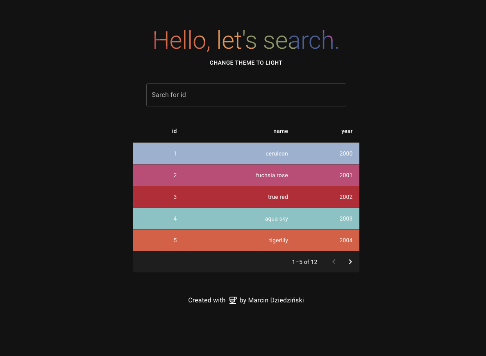

# ColorFilterApp

## Welcome! 👋

This is my color filter app built using React and [ Reqres API](https://reqres.in/)

## Features

This is simple single page application that allows to filter colors depending on id fetched from reqres API and show item's details. It was built in React (TypeScript).
It includes server side filtering and pagination, error handling and url search params. 
UI was built using Material UI, thanks to that, there is simple theme toggle for dark and light theme. 

## Tools used

- React
  - Material UI
  - TypeScript
  - Axios
  - React Router
- Reqres API

## Live website

- [ColorFilterApp live on Netlify](https://cerulean-croquembouche-a38916.netlify.app/)
